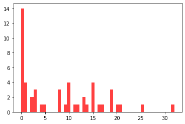

Autor: Leszek Stencel
Indeks: 122024
Zbiór danych: http://networkrepository.com/ia-infect-dublin.php

Opis zbioru danych
Przedstawiony zbiór danych zawiera zbiór osób zarażonych wirusem grypy w Dublinie.
Przez wierzchołek grafu oznaczona jest osoba, krawędź pomiędzy wierzchołkami to kontakt pomiędzy zarażonymi.


```python
import requests
# url = 'http://nrvis.com/download/data/ia/ia-infect-dublin.zip'
# content = requests.get(url)

file_name = 'ia-infect-dublin.mtx'
```


```python
import networkx as nx

graph = nx.Graph()
```


```python
with open(file_name, 'r') as file:
    for iter, line in enumerate(file):
        if iter > 1:
            line = line.split()
            graph.add_edge(line[1], line[0])
```


```python
degree = dict(graph.degree())
sorted_degree = [(r, degree[r]) for r in sorted(degree, key=degree.get, reverse = True)]
```

Statystyki sieci


```python
print('Number of nodes:', len(graph.nodes()))
print('Number of edges:', len(graph.edges()))
print('Graph density:', round(nx.density(graph),5))
print('Graph diameter:', nx.diameter(graph))
print('Max degree: ',sorted_degree[0][1])           
print('Min degree:', sorted_degree[-1][1])
```

    Number of nodes: 410
    Number of edges: 2765
    Graph density: 0.03298
    Graph diameter: 9
    Max degree:  50
    Min degree: 1


```python
%matplotlib inline
import matplotlib.pyplot as plt
```

Rozkład stopnia wierzchołków


```python
plt.figure(figsize=(5,15))
plt.barh([id[0] for id in sorted_degree], [id[1] for id in sorted_degree])
plt.show()
```


Histogram stopnia wierzchołków


```python
plt.hist(nx.degree_histogram(graph), bins=50, alpha=0.75, color='red')
plt.show()

```





Rozkład centralności wierzchołków


```python
centrality = nx.degree_centrality(graph)
sorted_centrality = [(v, centrality[v]) for v in sorted(centrality, key=centrality.get, reverse = True)]
# print(sorted_centrality)

plt.figure(figsize=(5,15))
plt.barh([id[0] for id in sorted_centrality], [id[1] for id in sorted_centrality])
plt.show()
```


Rozkład bliskoći wierzchołków


```python
cls_centrality = nx.closeness_centrality(graph)
# print(cls_centrality)
sorted_cls_centrality = [(v, cls_centrality[v]) for v in sorted(cls_centrality, key=cls_centrality.get, reverse = True)]
# print(sorted_centrality)

plt.figure(figsize=(5,15))
plt.barh([id[0] for id in sorted_cls_centrality], [id[1] for id in sorted_cls_centrality])
plt.show()
```


Rozkład pośrednictwa wierzchołków


```python
betweenness = nx.betweenness_centrality(graph)
sorted_betweenness = [(v, betweenness[v]) for v in sorted(betweenness, key=betweenness.get, reverse = True)]

plt.figure(figsize=(5,15))
plt.barh([id[0] for id in sorted_betweenness], [id[1] for id in sorted_betweenness])
plt.show()
```


Rozkład klastrowania wierzchołków


```python
clustering = nx.clustering(graph)
sorted_clustering = [(v, clustering[v]) for v in sorted(clustering, key=clustering.get, reverse = True)]
# print(sorted_centrality)

plt.figure(figsize=(5,15))
plt.barh([id[0] for id in sorted_clustering], [id[1] for id in sorted_clustering])
plt.show()
```


Pytania 
1. Na wstępnych etapach epidemii, zidentyfikować osobę którą należy zaszczepić, w celu ograniczenia przenoszenia wirusa.
2. W prypadku podejrzenia powtórzenia epidemi, ustalić osoby które należy odizolować, które mają najwięcej kontaktów z innymi osobami.  
3. Identyfikacja osób które mogą przekazać informacje o leczeniu, prewencji itp. innym chorym.


```python
# 1
sorted_betweenness[:20]
nx.drawing.nx_pylab.draw_networkx_nodes(graph,pos=nx.spring_layout(graph),nodelist=[id[0] for id in sorted_betweenness[:20]], node_size=10, labels=True)
```


    <matplotlib.collections.PathCollection at 0x7f37bc0b7e10>


```python
# 2
sorted_degree[:20]
nx.drawing.nx_pylab.draw_networkx_nodes(graph,pos=nx.spring_layout(graph),nodelist=[id[0] for id in sorted_degree[:20]], node_size=10, edges=True)
```


    <matplotlib.collections.PathCollection at 0x7f37bc3717b8>


```python
# 3
nx.drawing.nx_pylab.draw_networkx_nodes(graph,pos=nx.spring_layout(graph),nodelist=[id[0] for id in sorted_cls_centrality[:20]], node_size=10, with_labels=True)
```


    <matplotlib.collections.PathCollection at 0x7f37bbccf908>


